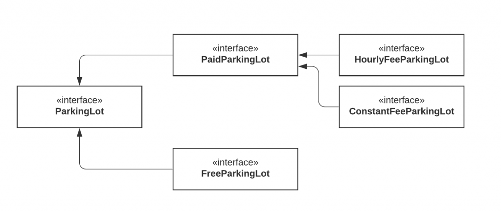

---
layout:
  title:
    visible: true
  description:
    visible: true
  tableOfContents:
    visible: true
  outline:
    visible: true
  pagination:
    visible: true
---

# Interface Segregation Principle

**Segregation means keeping things separated, and the Interface Segregation Principle is about separating the interfaces.**

The principle states that many client-specific interfaces are better than one general-purpose interface. Clients should not be forced to implement a function they do no need.

If there’s a class that implements a part of the interface, then the interface should be split into smaller interfaces that can be used separately.

## Example

We modeled a very simplified parking lot. It is the type of parking lot where you pay an hourly fee.

```
public interface ParkingLot {

	void parkCar();	// Decrease empty spot count by 1
	void unparkCar(); // Increase empty spots by 1
	void getCapacity();	// Returns car capacity
	double calculateFee(Car car); // Returns the price based on number of hours
	void doPayment(Car car);
}

class Car {

}
```

Now consider that we want to implement a parking lot that is free.

```
public class FreeParking implements ParkingLot {

	@Override
	public void parkCar() {
		
	}

	@Override
	public void unparkCar() {

	}

	@Override
	public void getCapacity() {

	}

	@Override
	public double calculateFee(Car car) {
		return 0;
	}

	@Override
	public void doPayment(Car car) {
		throw new Exception("Parking lot is free");
	}
}
```

Our FreeParking class was forced to implement payment-related methods that are irrelevant.

### Solution

Let's separate or segregate the interfaces.

Also we can even go further and split the PaidParkingLot to support different types of payment.



Now our model is much more flexible, extendable, and the clients do not need to implement any irrelevant logic because we provide only parking-related functionality in the parking lot interface.
