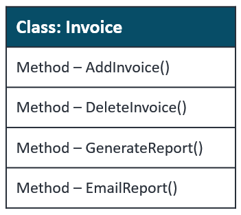
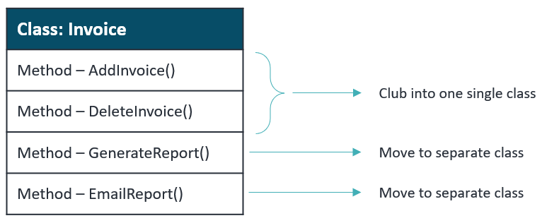
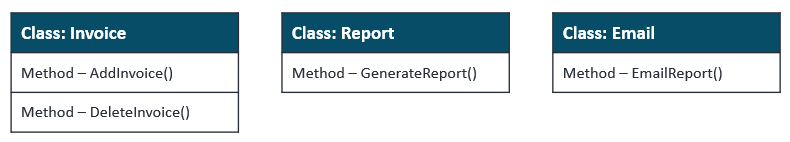

---
layout:
  title:
    visible: true
  description:
    visible: true
  tableOfContents:
    visible: true
  outline:
    visible: true
  pagination:
    visible: false
---

# Single Responsibility Principle (SRP)

**A class should do one thing and therefore it should have only a single reason to change.**

Every module, class, or function should have responsibility for a single part of the functionality provided by the software, and that responsibility should be entirely encapsulated by the class.

Following the Single Responsibility Principle is important. First of all, because many different teams can work on the same project and edit the same class for different reasons, this could lead to incompatible modules.

Merge conflicts are example. They appear when different teams change the same file. But if the SRP is followed, fewer conflicts will appear – files will have a single reason to change, and conflicts that do exist will be easier to resolve.

> Having multiple responsibilities within a single class means that these responsibilities are coupled

## Example

The class Invoice consists of 4 different methods. As the single responsibility principle says, your class or method should have only one responsibility and only one reason to change. So we should split this class.


[Open\_Closed\_Principle.md](Open\_Closed\_Principle.md)

